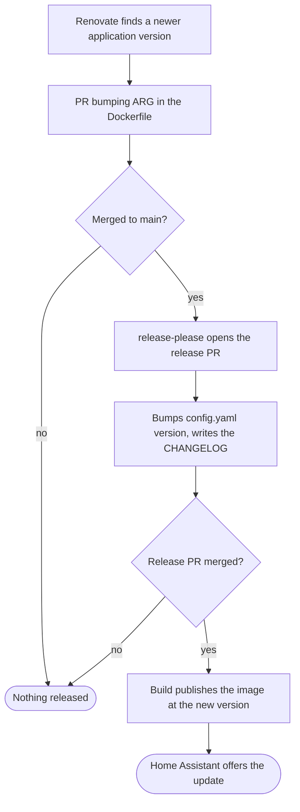

# AGENTS.md

Guidance for coding agents working in this repository.

## What this is

A Home Assistant **app repository**. Home Assistant calls these apps; they were
called add-ons until 2026, and both names still appear in its own tooling. This
repository says "application" in everything it writes, and keeps Home
Assistant's spelling wherever its API surface demands it.

Every top-level directory containing a `config.yaml` is one application. Home
Assistant reads `repository.yaml` to discover the repository, then each
`config.yaml` to discover what it can install.

The authorities, in the order you should trust them:

1. **[Home Assistant Supervisor](https://github.com/home-assistant/supervisor)**
   — the code that actually runs these. When the documentation and the source
   disagree, the source is right.
2. **[home-assistant/apps-example](https://github.com/home-assistant/apps-example)**
   — the reference implementation. Match its shape unless there is a reason not
   to, and record the reason.
3. **[The apps documentation](https://developers.home-assistant.io/docs/apps)**
   — correct in the large, occasionally behind in the details.
4. **`frenck/action-addon-linter`** — not an authority, but it is the gate. It
   has had no release since 2025-11 and rejects things Supervisor accepts. See
   Traps.

## Adding an application

### 1. Start from existing packaging

Someone has usually packaged it already, most often under
[hassio-addons](https://github.com/orgs/hassio-addons/repositories) as
`app-<name>` or `addon-<name>`. Port that rather than inventing one: the service
scripts, icon, and logo are all reusable, and it is MIT licensed.

Credit the original in the application's `DOCS.md`, and credit the upstream
project separately — the packaging and the software it packages have different
authors and usually different licences.

Do not copy the pinned version. Check what the project has actually released;
the community packaging is often behind, which is usually why an application is
being added here at all.

### 2. Create the directory

Match what the existing applications have:

```
<slug>/
├── CHANGELOG.md      Keep a Changelog format
├── DOCS.md           installation, configuration, storage, backups, credits
├── Dockerfile
├── README.md         short intro, shown in the store
├── config.yaml
├── icon.png          square, 128×128
├── logo.png          landscape, around 250×100
├── rootfs/           s6 service definition
└── translations/     en.yaml, pt-BR.yaml
```

`README.md` and `DOCS.md` are different documents. The store shows the README as
the intro and DOCS as the full documentation.

### 3. `config.yaml`

Keys are ordered by name. Required: `name`, `version`, `slug`, `description`,
`arch`.

```yaml
arch:
  - aarch64
  - amd64
backup: cold
image: 'ghcr.io/kanso-labs/home-assistant-application-<slug>'
init: false
version: '1.0.0' # x-release-please-version
```

- **`image`** is the generic multi-architecture name, with no `{arch}`
  placeholder. See "Image naming" below.
- **`init: false`** because the base image supplies s6-overlay.
- **`backup: cold`** for anything storing state in SQLite, which is most of
  them. A hot backup copies the database while it is being written and can
  restore into a corrupt file.
- **`version`** starts at `1.0.0` and is never edited by hand afterwards. The
  annotation is load-bearing; see Releases.

Map the least you can. Grant write access only where the application actually
writes, and omit a mapping entirely when it is never touched. Radarr and Sonarr
need `/media` and `/share` because organising files is their job. Prowlarr
manages indexer definitions and gets neither, even though its upstream packaging
maps both.

### 4. `Dockerfile`

```dockerfile
# https://developers.home-assistant.io/docs/apps/configuration#app-dockerfile
ARG BUILD_FROM=ghcr.io/home-assistant/base:3.24
FROM ${BUILD_FROM}

ARG BUILD_ARCH=amd64
ARG BUILD_VERSION=dev
# renovate: datasource=github-releases depName=<Org>/<Repo>
ARG <APP>_VERSION=1.2.3
```

- **`BUILD_FROM` must carry a default.** Supervisor stopped supplying it in
  2026.04, so `FROM $BUILD_FROM` with no default expands to `FROM ` and fails.
- **There is no `build.yaml`.** It is deprecated. The base image and the OCI
  labels live in the Dockerfile.
- **`BUILD_ARCH` and `BUILD_VERSION` are injected** by the build action, along
  with the `io.hass.*` labels. Do not duplicate those labels.
- The `# renovate:` annotation is load-bearing; see Releases.

`ghcr.io/home-assistant/base` is Alpine and supplies s6-overlay, bashio, curl,
and jq. `base-ubuntu` is the Debian-family equivalent. Both are multi-arch, so
one tag covers every architecture.

### 5. `rootfs/`

Copy the upstream service definition. The layout Supervisor expects:

```
rootfs/etc/s6-overlay/s6-rc.d/<slug>/run          executable
rootfs/etc/s6-overlay/s6-rc.d/<slug>/finish       executable
rootfs/etc/s6-overlay/s6-rc.d/<slug>/type         contains "longrun"
rootfs/etc/s6-overlay/s6-rc.d/<slug>/dependencies.d/base    empty
rootfs/etc/s6-overlay/s6-rc.d/user/contents.d/<slug>        empty
```

`run` and `finish` need the executable bit. The empty marker files must exist
and stay empty.

### 6. Register it

- Add a section to the repository `README.md`, in alphabetical order.
- Add the package to `release-please-config.json` and
  `.release-please-manifest.json`, both alphabetically.

### 7. Verify before pushing

Every one of these has caught a real failure. Run them.

**Validate against the linter's own schema**, rather than waiting for CI to tell
you:

```shell
gh api repos/frenck/action-addon-linter/contents/src/config.schema.json \
  --jq '.content' | base64 -D > /tmp/addon.schema.json
```

Then check your `config.yaml`'s map types and top-level keys against it. This
exists because the linter rejects values Supervisor documents as current.

**Build and boot it.** A green build proves nothing about whether the thing
starts:

```shell
docker build --platform linux/arm64 --build-arg BUILD_ARCH=aarch64 \
  --build-arg BUILD_VERSION=1.0.0 -t <slug>-test .
```

Run it with `/config` and `/data` mounted, then check the logs for the version
and a listening port, and probe the port for a response. Build for the
architecture you are actually on — see Traps.

**Run `npx prettier --check`** over the application directory. Prettier formats
YAML, JSON and Markdown here, and CI checks it.

**Verify the release wiring**, which catches a registration you forgot in step 6
and an annotation you dropped:

```shell
./.github/scripts/verify-release-wiring.sh
```

CI runs this too, as `Verify release wiring`.

## Conventions

### Key ordering

Keys in JSON and YAML configuration files are ordered by name. Files whose order
carries meaning are exempt: workflows, where step order is execution order;
changelogs, which are chronological; and `package.json`, where the npm ecosystem
expects `name` and `version` first.

### Workflow naming

A workflow's filename is the kebab-case of its `name:` field. Reusable
workflows, meaning those triggered only by `workflow_call`, take a leading
underscore. Job names and step names are imperative verb phrases. Job ids, step
ids, and matrix keys are exempt.

### Image naming

An application's `image` is the generic multi-architecture name with no
placeholder. The per-architecture images published underneath it are named
`{arch}-<image>`, architecture first — that order is fixed by the build action
and is not ours to choose.

### Commits

Pull requests are squash-merged, with the pull request title as the commit
subject and an empty body. That title becomes the only commit on `main`, so it
is the single input to everything below. Branch commit messages are discarded by
the squash and never reach history.

The title is a Conventional Commit. Its type decides whether users see the
change:

| Type of the pull request title | Effect                                               |
| ------------------------------ | ---------------------------------------------------- |
| `feat`                         | releases the application, minor bump                 |
| `fix`                          | releases the application, patch bump                 |
| anything else                  | no release, so nothing reaches an installed instance |

Write branch commits conventionally anyway. They are what a reviewer reads while
the pull request is open, even though only the title survives the merge.

## Releases

Home Assistant decides an update exists by comparing `config.yaml`'s `version`
against the installed one — a plain inequality, so the string only has to move.
If it never moves, nothing you change inside an image ever reaches anyone.

Nobody edits that field by hand. release-please owns it.



Each application is its own release-please package. A commit is attributed to
one by the files it touches, so a change under `radarr/` releases Radarr alone.

**There is one release pull request, not one per application.** Each application
still gets its own version, tag and changelog inside it; what is shared is the
pull request carrying them. `separate-pull-requests` was `true` until several
applications first became releasable at once, and the reason it cannot go back
is in Traps.

**Two annotations hold this together, and removing either fails silently.**

- `# x-release-please-version` beside `version` in `config.yaml` tells
  release-please which line to rewrite.
- `# renovate: datasource=… depName=…` above the `ARG` in the Dockerfile tells
  Renovate what to watch.

Neither produces an error when missing. The application simply stops receiving
updates, and nobody notices until someone checks.

`.github/scripts/verify-release-wiring.sh` is that check for the first one, and
for the registrations in step 6. It runs in CI as `Verify release wiring`.
Nothing yet guards the Renovate annotation.

## Traps

**Merge commits are disabled, and re-enabling them duplicates every changelog
entry.** A merge commit carries the pull request title in its body, where it
parses as a Conventional Commit, and it brings the branch's own commit onto
`main` alongside it. release-please counts both and writes two entries with
different SHAs and identical text. That is not hypothetical: it produced 10
duplicated pairs across four open release pull requests before merge commits
were turned off. Squashing writes one commit, and rebasing adds no merge commit
to double-count, so both remaining strategies are safe.

**A stale release pull request cannot merge, and release-please will not refresh
it.** release-please rewrites a release pull request only when the release it
computes changes. One whose release is unchanged keeps its original base for
good, so everything merged to main since then leaves it behind.
`.release-please-manifest.json` is enough to make that fatal on its own: its
keys are one per application in alphabetical order, so releasing an
application's alphabetical neighbour is an adjacent-line change and git refuses
to merge it. Releasing qbittorrent and seerr is what stranded Radarr.

`separate-pull-requests: false` is what keeps it from recurring. One release
pull request at a time means nothing can land a competing manifest edit while it
is open, so the neighbours it would have collided with no longer exist. The cost
is that releases batch: you cannot hold one application back while shipping
another.

**Setting `separate-pull-requests` back to `true` brings the conflicts back the
same day**, and the flag alone will not fix them. What that needs is a workflow
step merging main into each open release pull request after every run and
resolving the manifest itself: take main's copy and overlay the keys the pull
request changed against its own merge base. That is always correct, because a
release pull request only ever moves the versions it is releasing. Conflicts
anywhere else are not worth guessing at and should be left to a human.

What remains is narrow enough to fix by hand. It needs a commit that both
changes no computed release, so `chore`, `docs`, `ci` or `refactor`, and touches
a line next to one the open release pull request is editing. Registering a new
application under a non-releasing type is the realistic way in.

**Concurrent release-please runs race each other.** Every release merge pushes
main and every push starts a run. Five auto-merges landing inside a minute
started five overlapping runs that tried to cut the same tags and strip the same
labels; one died on `Label does not exist`. The workflow has a `concurrency`
group now. Do not add `cancel-in-progress` — the last push must still get a run.

**Nothing enforces any of this.** There is no commitlint in this repository — no
configuration, no dependency, no hook — and `.github/workflows/lint.yaml` runs
only `frenck/action-addon-linter` over each application directory. Nothing reads
the pull request title. A malformed one reaches `main` unchallenged and either
lands in a changelog exactly as written or silently skips a release that should
have happened.

**One pull request, one application.** Attribution is by the files a commit
touches, and squashing makes a pull request exactly one commit. So a pull
request touching two applications writes a line into both changelogs and
releases both, at whatever bump its single title implies — there is no way to
say `feat` for one and `fix` for the other. Keeping a pull request to one
application is what keeps changelogs clean.

**The linter is behind Supervisor.** Supervisor deprecated `addon_config` for
`app_config` in 2026.07, but `frenck/action-addon-linter` only accepts the old
spelling and has had no release since 2025-11. Home Assistant's own apps-example
runs the same linter. Use `addon_config` and leave the comment explaining why.
Validate against the linter's schema locally rather than discovering this in CI.

**Every arr project names its release assets differently.** These cannot be
copied between applications:

| Project  | Asset pattern                                             |
| -------- | --------------------------------------------------------- |
| Radarr   | `Radarr.master.<version>.linux-musl-core-<arch>.tar.gz`   |
| Sonarr   | `Sonarr.main.<version>.linux-musl-<arch>.tar.gz`          |
| Prowlarr | `Prowlarr.master.<version>.linux-musl-core-<arch>.tar.gz` |

Check the published assets for the version you are pinning. A wrong URL fails
only at build time.

**Every `curl` of a GitHub release asset needs retries and `-f`.** Release
downloads return 503, or die mid-transfer, often enough to redden several builds
an hour during a bad spell, and each architecture of each application is another
draw. Plain `curl -L -o` handles neither: without `--retry` the first failure is
fatal, and without `-f` a 503 body is written to the file and curl exits 0, so
the build fails later in `tar` or `gunzip` with something that reads like a
corrupt release. Use
`curl -J -L -f --retry 8 --retry-all-errors --retry-max-time 180 -o`.

`--retry-all-errors` is the load-bearing flag — bare `--retry` covers 5xx but
not the connection dying mid-transfer, which is half of what is seen. The window
has to be minutes rather than seconds: a fixed five-second delay across five
retries covers under thirty seconds, and a spell outlasted that in three jobs of
one run. Leave `--retry-delay` off so the backoff stays exponential, and bound
it with `--retry-max-time` instead.

The same spell leaves most jobs of the same run untouched, so it is throttling
rather than an outage, and firing every application at once is what draws it.
That is why `build.yaml` caps `max-parallel`.

**amd64 images cannot be booted on an arm64 host.** The build succeeds, then x64
.NET dies at startup with a `NullReferenceException` inside NLog. It is
emulation, not your port. Build and boot `aarch64` natively, and let CI cover
amd64 on a native runner.

**A green build is not a working application.** Radarr, Sonarr and Prowlarr all
built cleanly while failing to start. Boot the container and probe the port.

**The build cache is scoped per application on purpose.** `build-image` scopes
its GitHub Actions cache to the architecture alone unless told otherwise, so a
repository building more than one image has every application writing `mode=max`
into the same two scopes and evicting whatever built last. Nothing fails, the
builds are just slower than they look. `cache-gha-scope` is set to the
application in `_build-application.yaml`, and removing it puts the eleven
applications back to sharing two scopes.

**`UpdateMethod=docker` disables the application's own updater.** These images
write it into `/opt/package_info` deliberately. The application will show that a
newer version exists and refuse to install it, which is why the packaging is the
only route to an update, and why the release chain above matters.

**`apparmor.txt` is not free.** n8n carries the apps-example template verbatim,
profile named `example` and referencing `/usr/bin/my_program`. Supervisor
rewrites the profile name to the slug so it loads, but it describes nothing
about n8n. Ship a real profile or ship none; do not copy that file.
