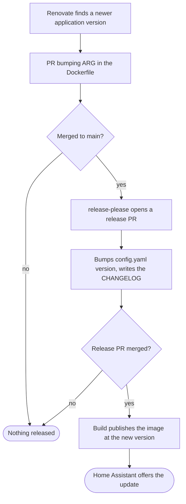

# Contributing

We are open to, and grateful for, any contributions made by the community. By
contributing to this project, you agree to abide by the
[code of conduct](https://github.com/kanso-labs/home-assistant-applications/blob/main/CODE_OF_CONDUCT.md).

## Reporting Issues and Asking Questions

Before opening an issue, please search the
[issue tracker](https://github.com/kanso-labs/home-assistant-applications/issues)
to make sure your issue hasn't already been reported.

## Development

Visit the
[issue tracker](https://github.com/kanso-labs/home-assistant-applications/issues)
to find a list of open issues that need attention.

Fork, then clone the repo:

```shell
git clone https://github.com/your-username/home-assistant-applications.git
```

### New Features

Please open an issue with a proposal for a new feature or refactoring before
starting on the work. We don't want you to waste your efforts on a pull request
that we won't want to accept.

### Workflow naming

A workflow's filename is the kebab-case of its `name:` field. Reusable
workflows, meaning those triggered only by `workflow_call`, take a leading
underscore so that entry points and building blocks separate visually in the
folder listing.

| `name:`             | Trigger                            | Filename                  |
| ------------------- | ---------------------------------- | ------------------------- |
| `Build`             | `push`, `pull_request`             | `build.yaml`              |
| `Lint`              | `push`, `pull_request`, `schedule` | `lint.yaml`               |
| `Build application` | `workflow_call`                    | `_build-application.yaml` |

Within a workflow, a job name is an imperative verb phrase with any matrix
values appended, and a step name is an imperative verb phrase in sentence case.
Job ids, step ids, and matrix keys are not held to this, since renaming them
means updating every `needs.*` and `steps.*` reference for no visible benefit.

`build.yaml` matches its own filename in a regular expression, so renaming
either build workflow means updating that pattern too.

## Releases

Home Assistant decides an update exists by comparing the `version` in an
application's `config.yaml` against the installed one. If that string never
moves, users never see the update, however much has changed inside the image. So
nothing is released by editing that field directly — release-please owns it.

Each application is its own release-please package, versioned independently. A
commit is attributed to an application by the files it touches, so a change
under `radarr/` releases Radarr and nothing else.

Pull requests are squash-merged, with the pull request title as the commit
subject and an empty body. Your branch commit messages are discarded by the
squash, so the title is the only one that reaches `main`. Write it as a
Conventional Commit.

Only a `fix` or `feat` title produces a release. A `chore` changes nothing a
user can see, so it deliberately does not. Nothing checks the title before it
merges, so a malformed one fails silently — it either lands in the changelog as
written or skips a release that should have happened.

The chain runs like this:



Two annotations hold it together, and both are load-bearing.

- `# x-release-please-version` beside the `version` in each `config.yaml` is how
  release-please knows which value to rewrite. Remove it and releases stop
  updating that application.
- `# renovate: datasource=… depName=…` above each `ARG <APP>_VERSION` in a
  Dockerfile is how Renovate knows what to watch. Remove it and that application
  silently stops receiving updates.

Renovate raises application bumps as `fix` rather than its usual `chore`, since
those are exactly the changes that need to reach users.

## Submitting Changes

- Open a new issue in the
  [Issue tracker](https://github.com/kanso-labs/home-assistant-applications/issues).
- Fork the repo.
- Create a new feature branch based off the `main` branch.
- Make sure all tests pass and there are no linting errors.
- Submit a pull request, referencing any issues it addresses.

Please try to keep your pull request focused in scope and avoid including
unrelated commits. Keep it to a single application where you can: a pull request
is one commit after the squash, so one touching two applications writes a line
into both changelogs and releases both, at whatever bump its single title
implies.

After you have submitted your pull request, we'll try to get back to you as soon
as possible. We may suggest some changes or improvements.

Thank you for contributing!
